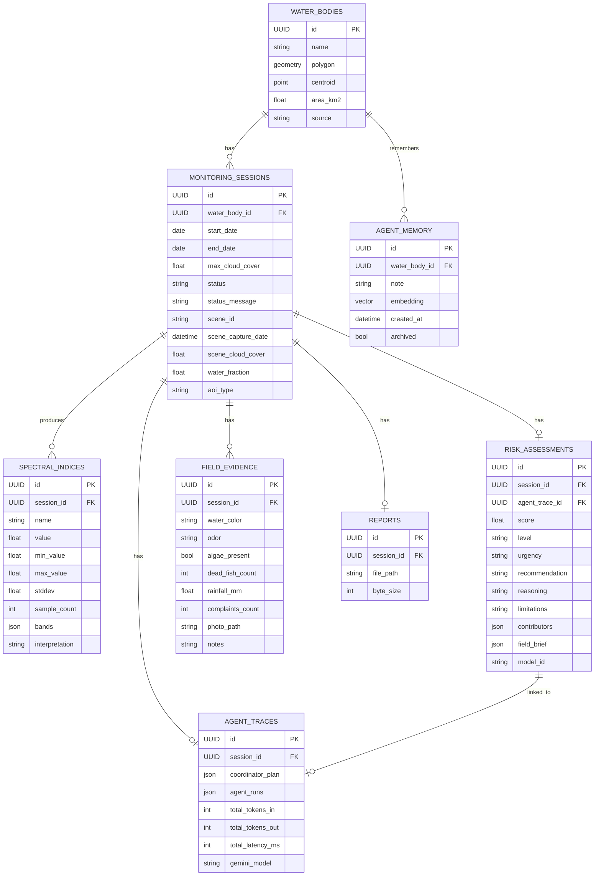

<div align="center">
    Autonomous freshwater monitoring with a deterministic analysis core and a traceable Gemini agent layer.
</div>

Advisory only. AquaLens helps teams prioritize sampling locations. It does not certify water safety or replace laboratory testing.

## Overview

AquaLens is a full-stack web app for freshwater monitoring. A user searches for a place, drops a map pin, or enters coordinates. The backend buffers that point into a monitoring polygon, fetches Sentinel-2 imagery, computes six water-quality spectral indices, and produces a deterministic risk assessment. A separate Gemini-powered agent workflow writes the human-facing field brief and citizen summary, while the backend stores the full session trace and report artifacts.

The numeric pipeline is deterministic. The agent layer can explain and summarize results, but it cannot change the risk score.

## What’s in the repo

- `backend/` FastAPI, SQLModel, Alembic, pipeline logic, agent orchestration, PDF generation, and pytest coverage.
- `frontend/` Next.js 15 App Router UI with map, session, evidence, and marketing surfaces.
- `docs/` Architecture, API contract, risk model, spectral indices, and user manual.
- `scripts/` Convenience launch scripts for backend and frontend.
- `docker-compose.yml` Local PostGIS, backend, and frontend stack.

## Quick Start

### Prerequisites

- Python 3.11 or newer
- Node.js 20 or newer
- pnpm 9
- Docker and Docker Compose if you want the containerized stack

### Environment variables

Create a `.env` at the repo root and set at least:

```bash
GOOGLE_API_KEY=sk-e63cd1444e6e19c9aeb2832dcfcacfc98a36ec7501ea6693a4bfc40fecae84ba
DATABASE_URL=sqlite:///./aqualens.db
CORS_ALLOW_ORIGINS=http://localhost:3000
```

Optional flags:

- `GOOGLE_API_KEY_FALLBACK`
- `GOOGLE_API_KEY_FALLBACK_2`
- `GEMINI_MODEL`
- `AQUALENS_FAKE_GEMINI=1` for deterministic local runs
- `AQUALENS_USE_SAMPLE_PROVIDER=1` for sample imagery in tests and demos
- `AQUALENS_AGENTIC_MODE=0` to force the single-call reasoning path

Do not commit API keys to the repository.

### Run locally with scripts

Backend:

```bash
./scripts/run-backend.sh
```

Frontend:

```bash
./scripts/run-frontend.sh
```

These scripts bootstrap a backend virtual environment and a frontend pnpm install if needed.

### Run with Docker

```bash
docker compose up --build
```

This starts PostGIS on port 5432, the backend on 8000, and the frontend on 3000.

### Run without Docker

**Backend** — Python 3.11+:

```bash
cd backend
python3 -m venv .venv
source .venv/bin/activate
pip install -e ".[dev]"
alembic upgrade head
uvicorn app.main:app --reload --reload-dir app --host 0.0.0.0 --port 8000
```

**Frontend** — pnpm + Node 20+:

```bash
cd frontend
pnpm install
pnpm dev
```

---

## Configuration

| Variable | Default | Purpose |
|---|---|---|
| `AQUALENS_AGENTIC_MODE` | `true` | Enables the Coordinator → Scout → Historian → Analyst → Reporter orchestration. When off, only Pipeline 1 + the deterministic narrator run. |
| `AQUALENS_FAKE_GEMINI` | `0` | Skips real Gemini calls; uses the deterministic narrator and a canned citizen summary. Used by CI. |
| `AQUALENS_AGENT_STEP_DELAY_MS` | `0` | Optional delay between agent stages for visible live-sequencing in demos. |
| `GEMINI_MODEL` | `gemini-2.0-flash` | Runtime Gemini model ID. |
| `GEMINI_EMBED_MODEL` | `text-embedding-004` | Used by the Historian's pgvector memory. |
| `REPORT_DIR` | `backend/data/reports` | Where regenerated PDFs are cached on disk. |
| `MAX_UPLOAD_BYTES` | `8388608` (8 MB) | Field-evidence photo upload ceiling. |
| `WATER_FRACTION_LAND_THRESHOLD` | `0.2` | Below this, the AOI is classified as land; agents are skipped. |
| `WATER_FRACTION_MIXED_THRESHOLD` | `0.7` | Below this (and ≥ land), the AOI is classified as mixed. |

Full schema: [`backend/app/core/config.py`](backend/app/core/config.py).

---

## API surface

All endpoints are mounted under **`/api/v1`**. Full payload schemas in [`docs/api_contract.md`](docs/api_contract.md); the live OpenAPI document is at `/docs` when the backend is running.

### Water bodies

| Verb | Path | Notes |
|---|---|---|
| `GET` | `/water-bodies` | List saved AOIs. |
| `POST` | `/water-bodies` | Create from a GeoJSON polygon or a buffered point. |
| `GET` | `/water-bodies/{id}` | Single AOI with centroid + area. |
| `PATCH` | `/water-bodies/{id}` | Rename / re-describe. |
| `DELETE` | `/water-bodies/{id}` | Cascade-deletes child sessions. |
| `POST` | `/water-bodies/bulk-delete` | Transactional multi-select delete. |

### Sessions

| Verb | Path | Notes |
|---|---|---|
| `POST` | `/sessions` | Kick off a new monitoring run. Returns immediately; pipeline runs in the background. |
| `GET` | `/sessions` | Paginated list, optionally filtered by `water_body_id`. |
| `GET` | `/sessions/{id}` | Full detail (status, indices, risk, citizen summary, evidence). |
| `GET` | `/sessions/{id}/indices` | The six computed indices with provenance. |
| `GET` | `/sessions/{id}/risk` | The risk row (level, urgency, recommendation, reasoning, limitations). |
| `POST` `GET` | `/sessions/{id}/evidence` | Submit / list field-evidence rows (re-scores the session). |
| `GET` | `/sessions/{id}/trace` | Multi-agent execution trace (404 when the agent layer was off). |
| `GET` | `/sessions/{id}/field-brief` | Legacy compatibility endpoint (404 when absent). |
| `GET` | `/sessions/{id}/report` | WeasyPrint PDF, re-rendered on every request so template fixes ship instantly. Downloads as `aqualens-analysis-YYYYMMDD.pdf`. |

### System

| Verb | Path | Notes |
|---|---|---|
| `GET` | `/health` | Liveness probe. Returns `{"status":"ok"}`. |

---

## Data model



Migrations live in `backend/alembic/versions/` and are applied via `alembic upgrade head`.

---

## Failure modes &amp; fallbacks

Every layer has a deterministic safety net so a session always produces a usable brief:

| Failure | Fallback |
|---|---|
| Gemini primary key 429 / quota | Roll over to `GOOGLE_API_KEY_FALLBACK[_2]`. |
| Coordinator parse error | Baseline plan: Scout + Analyst + Reporter (Historian when history exists). |
| Scout vision timeout | Use freshest STAC candidate under the cloud-cover ceiling. |
| Historian failure | Analyst runs without the briefing; memory write is skipped. |
| Analyst failure | Deterministic narrator from `app.services.reasoning._fake_bundle`. |
| Reporter failure | Deterministic citizen summary from `app.services.citizen_summary`. |
| AOI classified as land or mixed | Pipeline 2 is skipped entirely (no Gemini cost); UI shows a *Not water* badge and the citizen summary explains why. |
| WeasyPrint render error | API returns 500 with the original message; cached PDFs are never served stale because regeneration happens on every download. |

All failures are recorded in the per-session trace — degraded behaviour is never silent.

---

## Tests &amp; quality gates

```bash
# Backend
cd backend
.venv/bin/python -m pytest -q            # ~90 tests in <10s on SQLite
.venv/bin/ruff check . && .venv/bin/black --check app/ tests/ alembic/

# Frontend
cd frontend
pnpm typecheck      # tsc --noEmit (strict)
pnpm lint           # next lint
pnpm test           # vitest unit tests
pnpm e2e            # Playwright against the compose stack
```

CI runs every gate plus the WeasyPrint smoke test on each PR.

---

## Deployment

| Surface | Provider | Notes |
|---|---|---|
| Backend | Render (Docker) | Blueprint in [`infrastructure/render.yaml`](infrastructure/render.yaml). |
| Frontend | Vercel | Config in [`infrastructure/vercel.json`](infrastructure/vercel.json). |
| Database | Postgres 16 + PostGIS + pgvector | Pinned in `docker-compose.yml` for local; managed Postgres in production. |

Walkthrough: [`infrastructure/deployment.md`](infrastructure/deployment.md).

---

## License

Source code and documentation are unlicensed. Third-party notices in [NOTICE.md](NOTICE.md).

Sentinel-2 imagery © European Union, contains modified Copernicus Sentinel data accessed via the Microsoft Planetary Computer.

---

## Deployment Links

- **Frontend:** [https://frontend-eight-gamma-82.vercel.app](https://frontend-eight-gamma-82.vercel.app)
- **Backend API:** [https://aqua-lens-backend.onrender.com](https://aqua-lens-backend.onrender.com)

## Author

**RidhimaKulashriz** — GitHub [@RidhimaKulashriz](https://github.com/RidhimaKulashriz)
